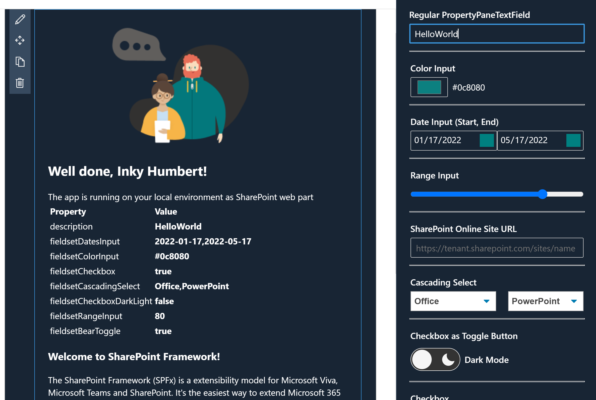

# React-PPP-HTML

## Applies to

- [SharePoint Framework](https://aka.ms/spfx)
- [Microsoft 365 tenant](https://docs.microsoft.com/en-us/sharepoint/dev/spfx/set-up-your-developer-tenant)

> Get your own free development tenant by subscribing to [Microsoft 365 developer program](http://aka.ms/o365devprogram)

## Compatibility

-Incompatible-red.svg "SharePoint Server 2016 Feature Pack 2 requires SPFx 1.1")

## Summary

The React-PPP-HTML sample showcases the use of the [Property Pane Portal](https://www.npmjs.com/package/property-pane-portal) to display HTML controls in the SPFx Property Pane.

## Used SharePoint Framework Version

## Solution

Solution|Author(s)
--------|---------
React-PPP-HTML | [Christophe Humbert](https://github.com/PathToSharePoint)

## Version history

Version|Date|Comments
-------|----|--------
0.1.0|January 17, 2022|

## Disclaimer

**THIS CODE IS PROVIDED *AS IS* WITHOUT WARRANTY OF ANY KIND, EITHER EXPRESS OR IMPLIED, INCLUDING ANY IMPLIED WARRANTIES OF FITNESS FOR A PARTICULAR PURPOSE, MERCHANTABILITY, OR NON-INFRINGEMENT.**

---

## Minimal Path to Awesome

- Clone this repository
- Ensure that you are at the solution folder
- in the command-line run:
  - **npm install**
  - **gulp serve**

## Features

This sample showcases the use of HTML controls in the SPFx Property Pane, without the need to build SPFx custom controls.

Implementations:
- Color picker
- Date pickers, with Start <= End
- Range slider
- Text box with URL validation
- Cascading selects
- Checkbox styled as toggle button

## References

- [Getting started with SharePoint Framework](https://docs.microsoft.com/en-us/sharepoint/dev/spfx/set-up-your-developer-tenant)
- [Building for Microsoft teams](https://docs.microsoft.com/en-us/sharepoint/dev/spfx/build-for-teams-overview)
- [Use Microsoft Graph in your solution](https://docs.microsoft.com/en-us/sharepoint/dev/spfx/web-parts/get-started/using-microsoft-graph-apis)
- [Publish SharePoint Framework applications to the Marketplace](https://docs.microsoft.com/en-us/sharepoint/dev/spfx/publish-to-marketplace-overview)
- [Microsoft 365 Patterns and Practices](https://aka.ms/m365pnp) - Guidance, tooling, samples and open-source controls for your Microsoft 365 development